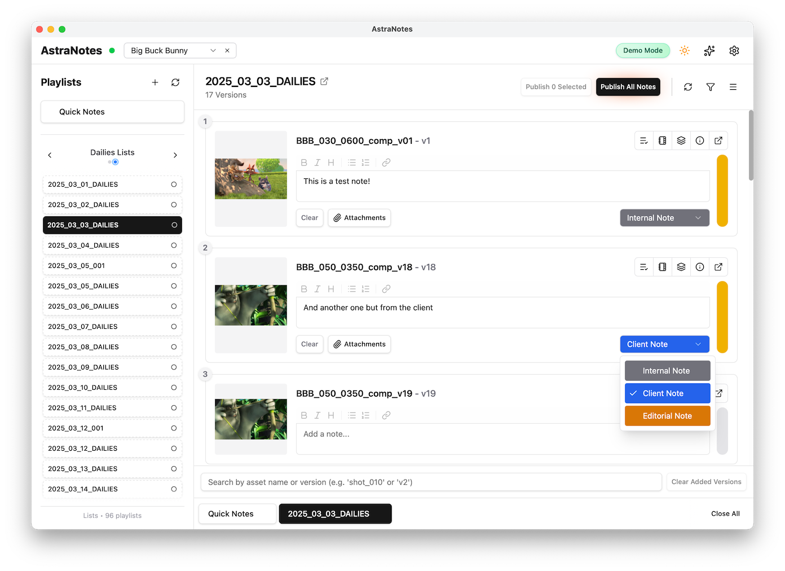
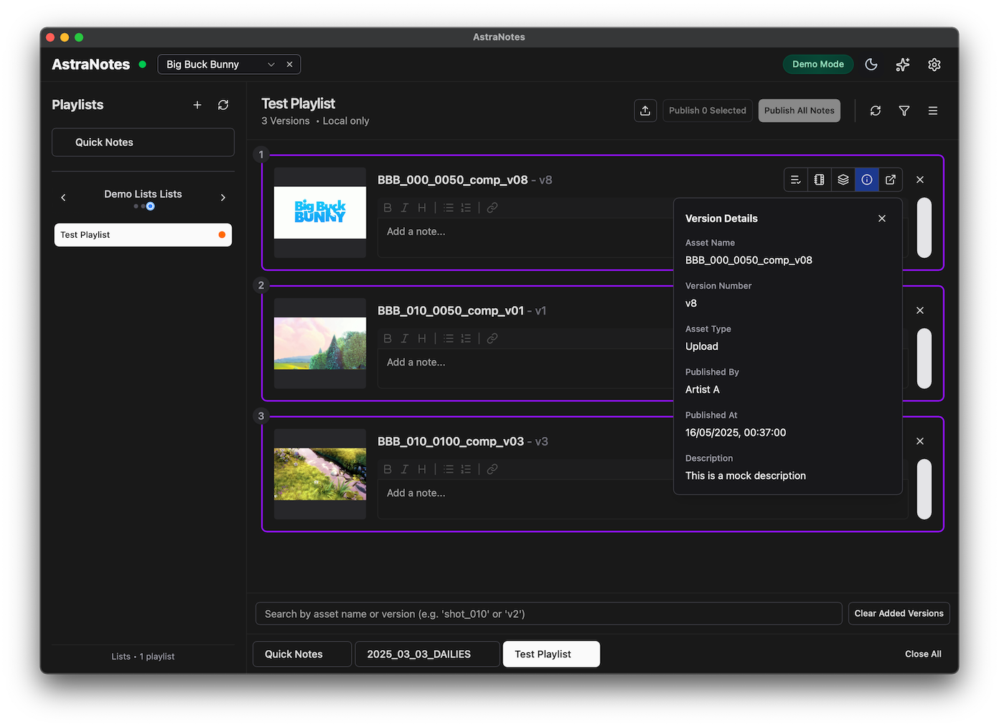
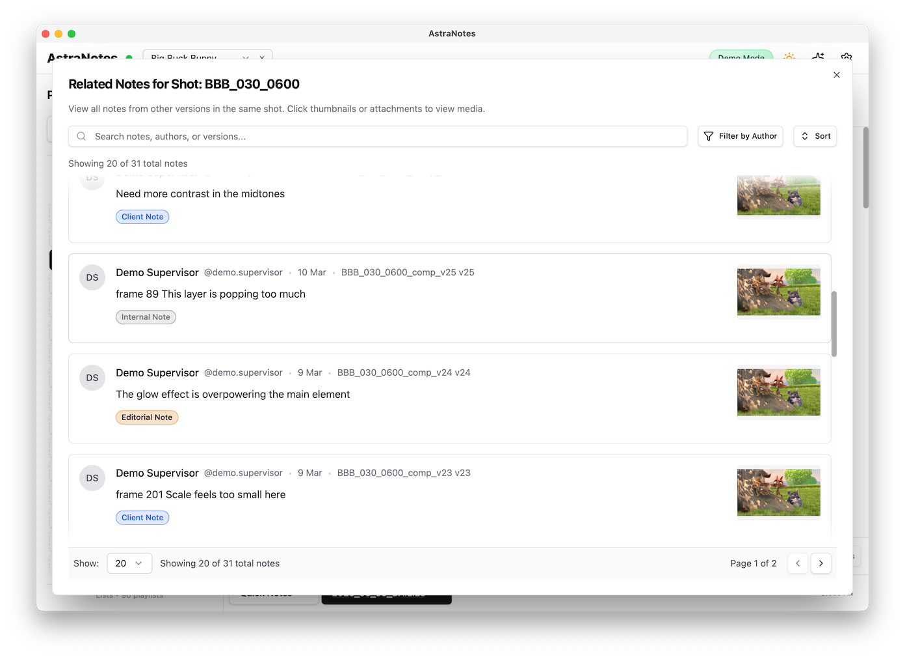
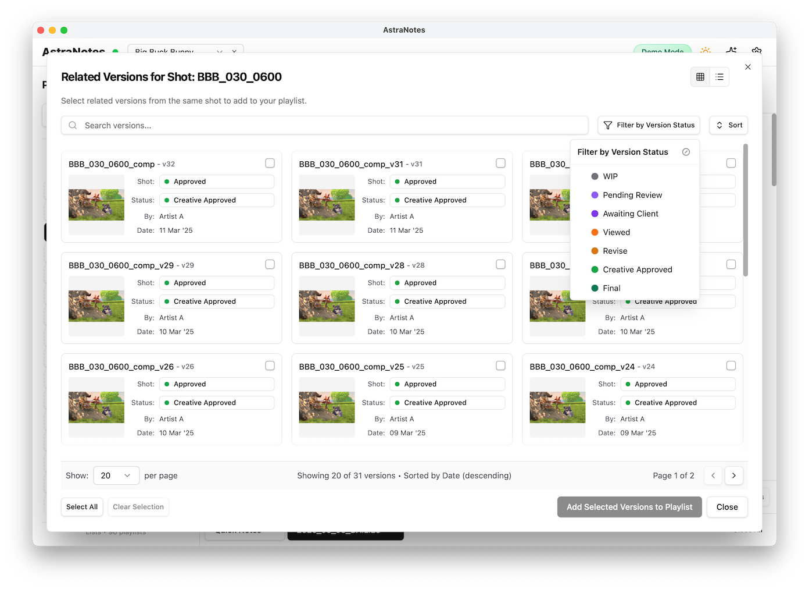
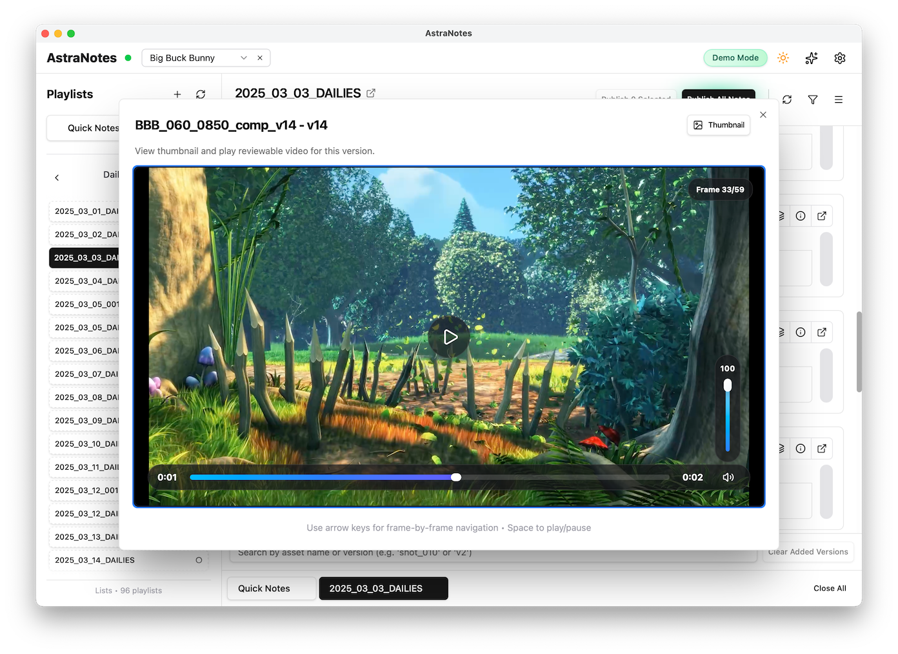
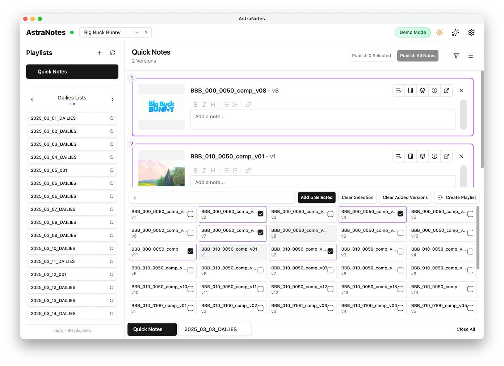
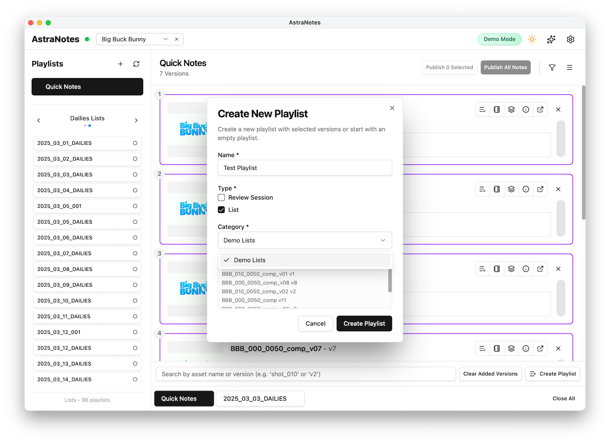
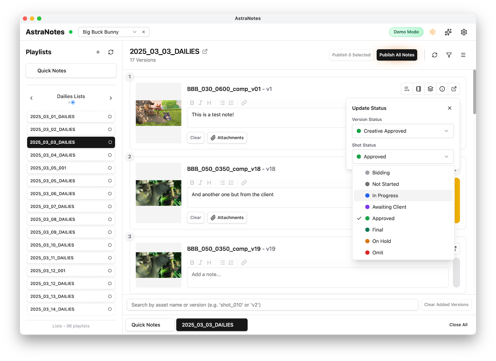

## NOTICE
Due to lack of ftrack access from mid-October 2025, this project will lose momentum and development will be paused.
Until then, I will continue to maintain the project, add features and fix bugs.
After then, I will only push security updates and critical bug fixes.

# AstraNotes

<p align="center">
  
</p>

<details>
  <summary><strong>Screenshots</strong></summary>

  <table>
    <tr>
      <td></td>
      <td></td>
    </tr>
    <tr>
      <td align="center"><em>Further version details + dark mode</em></td>
      <td align="center"><em>Notes related to the current shot</em></td>
    </tr>
    <tr>
      <td></td>
      <td></td>
    </tr>
    <tr>
      <td align="center"><em>Other versions related to the current shot</em></td>
      <td align="center"><em>Thumbnail and playable media previews</em></td>
    </tr>
    <tr>
      <td></td>
      <td></td>
    </tr>
    <tr>
      <td align="center"><em>Add 1 or more versions to a playlist</em></td>
      <td align="center"><em>Create a new local offline playlist</em></td>
    </tr>
    <tr>
      <td></td>
      <td></td>
    </tr>
    <tr>
      <td align="center"><em>Change Shot/Version statuses live</em></td>
      <td></td>
    </tr>
  </table>
</details>

## Features

- 🎬 **Broad Playlist Support**: Browse, view and create ftrack client review and list playlists.
- 📂 **Project Selection**: Quickly switch between ftrack projects.
- ✍️ **Note Creation**: Create, edit, and publish notes on versions.
- 🏷️ **Label Support**: Categorise notes with customizable labels pulled from ftrack.
- ⚙️ **Status Management**: View and update shot and version statuses directly.
- 📊 **Quick Notes**: Create notes on any version, on the fly, without a playlist.
- 🔄 **Smooth Syncing**: At the touch of button pull in new ftrack playlists and changes to an existing playlist
- 🔍 **Version Search**: Find and manually add specific versions to playlists, on the fly, without affecting ftrack.
- 🔗 **Related Versions**: View all other versions related to the current version. Add them to the playlist manually.
- 🔗 **Related Notes**: View all other notes related to the current shot.
- 💾 **Offline Persistence**: Draft notes offline and publish when connected, all data is stored locally on device.
- 📤 **CSV Export**: Export notes to CSV
- 📄 **PDF Export**: Export notes to PDF
- 🖼️ **Thumbnail Previews**
- 🔄 **Auto-updates**
- 🌙 **Dark Mode**

## Installation

### Requirements

- Windows 10/11 or macOS 10.13+
- [ftrack](https://www.ftrack.com/) credentials (API key, server URL, and user)

### Download

Download the latest release for your platform:

- [Windows Installer (.msi)](https://github.com/matteoveglia/AstraNotes/releases/latest)
- [macOS App (.dmg)](https://github.com/matteoveglia/AstraNotes/releases/latest)

### macOS Gatekeeper

macOS blocks apps from unsigned developers by adding a quarantine flag. Because AstraNotes is a hobby project without a paid Apple developer certificate, you must remove that flag after installing:

```bash
xattr -rd com.apple.quarantine /Applications/AstraNotes.app
```

Run the command in Terminal after dragging AstraNotes into `/Applications/`. Without it, the app will not launch and will display as "damaged".

## Configuration

AstraNotes requires ftrack credentials for authentication. Upon first launch, you'll need to configure:

1. **ftrack Server URL**: Your ftrack instance URL (e.g., `https://yourcompany.ftrackapp.com`)
2. **API Key**: Your ftrack API key
3. **API User**: Your ftrack username (email)

**For compatibility details, see [Ftrack API Objects & Attributes](./docs/ftrack-api-objects.md).**

These settings can be updated anytime through the settings panel.

## Demo Mode (Offline Mock Data)

- **What it is**: A self-contained Big Buck Bunny dataset bundled with AstraNotes so you can explore playlists, notes, and status flows without an ftrack account.
- **How to enable**: Open the Settings panel and click **Enable Demo Mode**. A confirmation dialog explains that caches will be cleared and the app will restart in mock mode.
- **How to disable**: Return to Settings and click **Disable Demo Mode** to restore the live ftrack connection.
- **Optional media**: Place the `AstraNotes_MockData` archive under `~/Downloads/` to unlock MOV previews. If the clips are missing, AstraNotes falls back to thumbnails. You can download the demo data from [here](https://drive.google.com/file/d/1oAtv3SXF21z1TcA_27aCD6KNZEbGxd9_/view?usp=sharing).

## Development
**For detailed development instructions, see [Development Guide](./docs/development.md).**

## Troubleshooting

### Common Issues

- **Connection Error**: Verify your ftrack credentials in Settings
- **Missing Thumbnails**: Check your connection to ftrack or reload the playlist

### Logs

AstraNotes logs can be exported from the Settings panel for troubleshooting.
- Click "Export Logs" to save a log file with the last 24 hours of activity.
- Toggle Debug logging if you need more detailed logs, please note, this will need to be toggled before the issue occurs and may cause performance degradation.

## 🛡️ Security

### VirusTotal Scan

AstraNotes has been scanned with VirusTotal to ensure it's free from malware and other security threats.

You can view the scan results here, for release v0.16.1.

#### Windows
- **File Hash**: 8b4c881e986d68458cb01828df2da26bb8c03ad02259dab26de96fcf62f9bcc7
- **Scan Results**: [View on VirusTotal](https://www.virustotal.com/gui/file/8b4c881e986d68458cb01828df2da26bb8c03ad02259dab26de96fcf62f9bcc7/detection)

#### macOS
- **File Hash**: 8b32bcccdafe5b24362b06097bdbb2fe40e78dba69ce579a048d112ce76d4349
- **Scan Results**: [View on VirusTotal](https://www.virustotal.com/gui/file/8b32bcccdafe5b24362b06097bdbb2fe40e78dba69ce579a048d112ce76d4349/detection)

We are committed to providing a secure application and regularly scan our releases to ensure your safety.

## Credits

AstraNotes is developed by [Astra Lumen Images](https://astralumen.co/).

## License

Copyright © 2025 Astra Lumen Images Inc. All rights reserved.

## Media Attribution

Demo thumbnails and preview clips are derived from [Big Buck Bunny](https://peach.blender.org/), © 2008 Blender Foundation. Used under the [Creative Commons Attribution 3.0 License](https://creativecommons.org/licenses/by/3.0/).